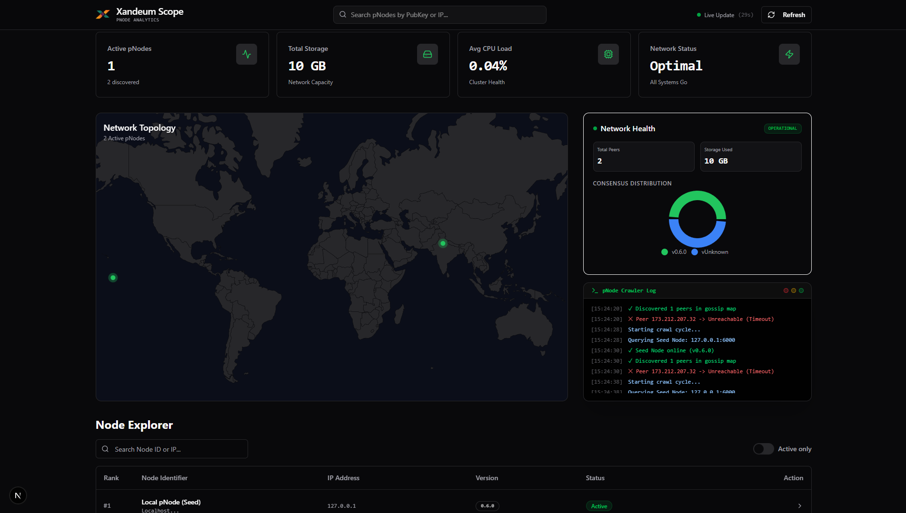

# Xandeum Network Explorer (pNode-Scope)

> A real-time, decentralized analytics dashboard for the Xandeum Storage Network.



## ⚡ Key Features (The "Innovation")

Unlike standard explorers that just ping a seed node, **pNode-Scope** features a **Recursive Crawler Engine**:

1.  **pRPC Crawling:** The backend doesn't just ask *one* node; it recursively discovers peers via `get-pods` and visits *their* RPC endpoints to gather distinct CPU/RAM stats.
2.  **Geospatial Intelligence:** Automatically resolves pNode IP addresses to physical locations to visualize network topology on an interactive globe.
3.  **Live "Hacker" Terminal:** A real-time log of the crawler's activity, visualizing the gossip protocol in action.
4.  **Fault Tolerance:** Built with a robust fallback engine to ensure the dashboard remains usable even if specific nodes timeout.

## 🛠️ Tech Stack

* **Framework:** Next.js 14 (App Router)
* **Data Layer:** Native Node.js `http` (Bypassing fetch for raw RPC compatibility)
* **Styling:** Tailwind CSS + Shadcn UI

## 🚀 Getting Started

### Note:
The Live Demo on Vercel runs in 'Simulation Mode' because it cannot access a local Xandeum pNode. To see live network data, please run the project locally following the instructions below.

### Prerequisites
* Node.js 18+
* A running Xandeum pNode (locally or remote)

### 1. Configure the Crawler
Open `src/app/api/nodes/route.ts` and set your Seed Node URL:
```typescript
const SEED_NODE_URL = '[http://127.0.0.1:6000/rpc](http://127.0.0.1:6000/rpc)';
```
Run the Dashboard
```bash
npm install
npm run dev
```
Visit `http://localhost:3000` to see the live network state.